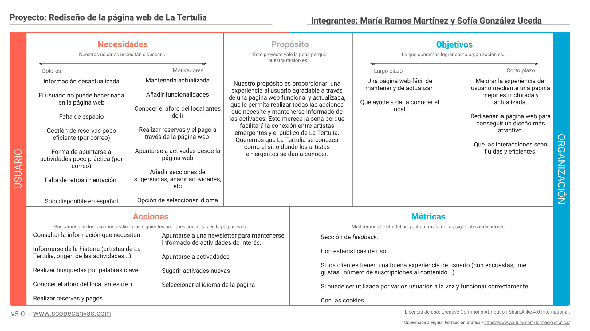
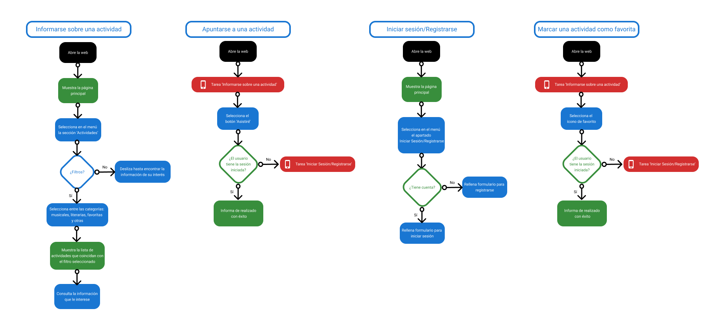
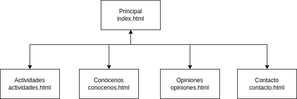
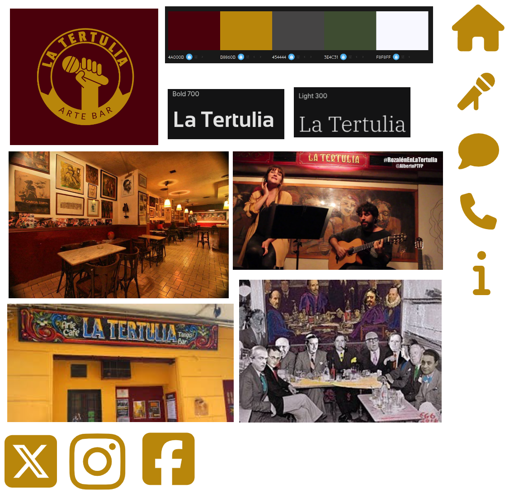
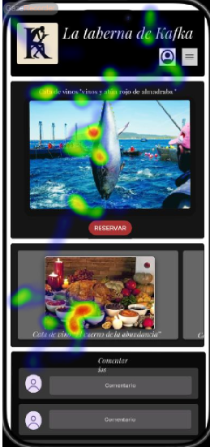
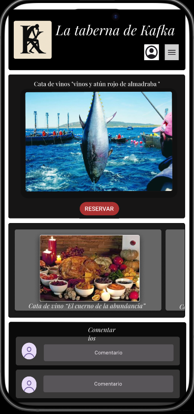

# DIU25
Prácticas Diseño Interfaces de Usuario (Tema: .... ) 

[Guiones de prácticas](GuionesPracticas/)

Grupo: DIU2.string  Curso: 2024/25 

Actualizado: 20/03/2025

Proyecto: 

La Tertulia

Descripción: 

Nuestra propuesta consiste en el rediseño total de la página web. Para ello queremos hacer un diseño más atractivo y mejor estructurado, de forma que la información esté disponible a partir de un menú y sea más accesible para el usuario. 

Logotipo: 

Miembros:
 * :bust_in_silhouette:  Sofía González Uceda    https://github.com/sofiiaglez11  :octocat:     
 * :bust_in_silhouette:  María Ramos Martínez    https://github.com/mariarmm :octocat:

----- 
# Proceso de Diseño 

 

## Paso 1. UX User & Desk Research & Analisis 

### 1.a User Reseach Plan
 
-----

Nuestro análisis va a ser sobre La Tertulia, un bar que combina actividades socioculturales
con gastronomía, ofreciendo la oportunidad a cualquier persona interesada en participar en
recitales, charlas, conciertos, etc.  
Para recopilar información, indagaremos en sus redes sociales (Facebook e Instagram),
donde se publica la planificación semanal de las actividades. Además, tendremos en cuenta
nuestra experiencia y la de algunos conocidos que frecuentan el sitio. Preguntaremos
acerca de su visión general y cómo se informan acerca del local y sus actividades, además
de, en cada caso, preguntas específicas según el tipo de usuario (si realizan alguna
actividad, cuál, si se apuntan a ellas y con qué método…). También aprovecharemos para
preguntarles qué necesitarían en una página web para que su experiencia como usuarios
mejore. Otro aspecto que tendremos en cuenta serán las reseñas de los usuarios en
distintos sitios web.  
Aunque la manera que tiene La Tertulia de informar a los usuarios es mediante sus redes
sociales, también tiene una página web pero está desactualizada. Haremos un análisis de
esta, viendo qué ofrece y qué aspectos pueden mejorar.

### 1.b Competitive Analysis
 
-----
●​ Cata de vinos - La taberna de Kafka https://www.instagram.com/latabernadekafka/  
La taberna de Kafka se encuentra en el centro de Granada (Calle Huete, 2). Es una
taberna especializada en vino donde ofrecen tapas caseras y platos, con la
posibilidad de opciones vegetarianas, veganas y sin gluten. Está enfocada a su
variedad de vinos, organizando numerosas catas. Para acudir a ellas, al ofrecer un
número limitado de plazas, normalmente se requiere reserva, que se puede realizar
a través de las redes sociales del local (que son la fuente de información para los
usuarios) o a través de Whatsapp. 
Para cada cata se detallan los vinos que se ofrecerán, además de que suelen seguir
una temática o estar relacionadas con alguna festividad. El precio suele estar por
debajo de los 30€.  
La taberna de Kafka está más enfocada al vino, mientras que la tertulia ofrece
actividades más variadas. Claramente, cada uno está enfocado a un público distinto.  
Las páginas de ambos son similares, ya que en los dos casos los locales cuentan
con Facebook e Instagram. Sin embargo, en la Tertulia se publican fotos con la
planificación semanal de actividades, mientras que en la taberna se sube una foto y
en la descripción se detalla la actividad, las fechas disponibles, el precio y los
métodos de contacto para reservar. 
En las reseñas de la taberna, los clientes destacan la gran variedad de vinos, y el
ambiente acogedor del lugar.  

●​ Talleres de comida  
Granada Cooking Experience se encuentra en pleno centro de Granada (Calle de la
Monterería, 16). Es un local dirigido a todos los amantes de la gastronomía que se
quieran ver inmersos en la elaboración de los platos que van a degustar. Organizan
talleres de cocina de diferentes culturas, además de catas de vino. También ofrecen
la posibilidad de reservar un taller en específico para grupos de 6 personas.  
Para reservar alguno de sus talleres se debe hacer a través de su página web, pero
también tienen redes sociales como Instagram o Facebook. El precio de los talleres
es de 50€, esto incluye los ingredientes y los utensilios de cocina que se necesite,
un profesor que te guía en la elaboración y 3 bebidas.  
Comparando ambos locales, Granada Cooking Experience aporta una experiencia
más culinaria ya que el cliente participa en la elaboración de los platos; mientras que
en La Tertulia el cliente no tiene esa posibilidad. Sin embargo, consideramos que
son conceptos muy distintos, en Granada Cooking Experience el objetivo es la
cocina y la degustación; mientras que la finalidad de La Tertulia no es la comida, si
no disfrutar de los espectáculos que ofrecen, charlar con amigos y realizar otras
actividades como, por ejemplo, aprender tango.  
Un aspecto destacable de Granada Cooking Experience es la comodidad para
reservar los talleres a través de su página web. En La Tertulia, si quieres asistir
como público, en algunos casos no debes hacer reserva. Sin embargo, hay otras
actividades con aforo limitado para las que tienes que hacer tu reserva mediante un
correo. Además, si quieres participar en algún espectáculo debes avisar también por
correo con antelación.  
Los clientes del Granada Cooking Experience remarcan que es una experiencia
diferente en la que puedes conocer gente y aprender de cocina.  

● Justificación de la elegida 
Hemos elegido La Tertulia porque es un lugar que conocemos y nos gusta. Además,
estamos acostumbradas al Instagram del local ya que solemos asistir a espectáculos de
música en directo y para ello consultamos la planificación semanal. Por tanto, sabemos qué
información suele ser la más interesante y somos conscientes de los aspectos que se
podrían mejorar. 
Comparándolo con los demás competidores, nos parece que es la opción más atractiva
teniendo en cuenta nuestros gustos y aficiones. Además, estamos familiarizadas con el
lugar y tenemos una idea de las personas que lo frecuentan. Conocer esto nos ayudará a
intuir qué necesidades pueden tener otras personas respecto a la Tertulia.  
Además, comparando su página web con la de Granada Cooking, por ejemplo, nos damos
cuenta de la importancia que tiene que un local tenga una plataforma para el usuario fácil y
accesible. Como la página actual de La Tertulia está muy lejos de eso, queremos ver cómo
podría mejorarse.  

### 1.c Personas
 
-----

https://github.com/sofiiaglez11/DIU2-string/blob/master/P1/PERSONA_USER_JOURNEY_BIANCA.pdf  
Hemos diseñado el perfil de Bianca porque representa a una generación de personas
jóvenes que quieren reivindicarse con su arte. Además, su pasión por la poesía hace que
Bianca cubra también el papel de cliente que va a La Tertulia no solo a consumir, sino
también a participar activamente en las actividades que ofrecen. 
También describe a un perfil de cliente típico de La Tertulia: los turistas; los cuales llegan a
la ciudad y quieren visitar sitios que le permita adentrarse en la cultura de Granada.  

https://github.com/sofiiaglez11/DIU2-string/blob/master/P1/PERSONA_USER_JOURNEY_DANIEL.pdf  
Hemos elegido a Daniel como nuestro segundo perfil por su pasión por el deporte y su
necesidad de aprender disciplinas nuevas constantemente. Consideramos que puede ser
una persona interesada en ir a La Tertulia para asistir a las clases de tango. 
También creemos que es un perfil bueno para representar el contraste entre él y Bianca.
Daniel es una persona adulta con un puesto de trabajo estable que quiere asistir a La
Tertulia para disfrutar de su tiempo libre; mientras que Bianca es un perfil más juvenil que
está interesada en asistir a La Tertulia no solo para disfrutar, si no también para
promocionar su trabajo.

### 1.d User Journey Map
 
----
Bianca. 

[USER JOURNEY MAP BIANCA](P1/PERSONA_USER_JOURNEY_BIANCA.pdf)  
Hemos hecho el Journey Map de Bianca con la idea de representar una experiencia
satisfactoria de un cliente. Bianca es una persona que muestra interés en asistir a La
Tertulia a una actividad en concreto y, al final, a pesar de no encontrar información y
frustrarse en el proceso, termina yendo porque confía en el criterio del amigo se lo
recomendó.  

Daniel 

[USER JOURNEY MAP DANIEL](P1/PERSONA_USER_JOURNEY_DANIEL.pdf)  
Con el Journey Map de Daniel hemos querido ejemplificar el caso de una persona que, a
pesar de tener bastante interés por asistir a una de las actividades que ofrecen, decide no ir
por la escasa información que encuentra en las redes sociales y en la página web. Así
demostramos la importancia de, entre otras cosas, mantener una página web actualizada y
útil para evitar perder potenciales clientes por el mal funcionamiento de esta.  

### 1.e Usability Review
 
----

- [Enlace al documento](https://github.com/sofiiaglez11/DIU2-string/blob/master/P1/Usability-review.pdf)
 - URL y Valoración numérica obtenida: 
- Comentario sobre la revisión:  (puntos fuertes y débiles detectados)

Al no tener página web funcional los resultados no son buenos. La página está desactualizada y sin apenas funcionalidades.

 

## Paso 2. UX Design  

### 2.a Reframing / IDEACION: Feedback Capture Grid / Empathy map 
 
----

|                        | **La Tertulia** | **Granada Cooking** | **La taberna de Kafka** |
|------------------------|-----------------|----------------------|--------------------------|
| **Página web**         | Desactualizada y sin funcionalidades | Actualizada y bien estructurada | No tiene |
| **Redes sociales**     | Instagram, Facebook y Twitter | Instagram, Facebook y Youtube | Instagram y Facebook |
| **Planificación de actividades** | Semanal | Mensual | Mensual |
| **Método de reserva de actividades** | Mandando un correo con la información | Comprando los talleres | Mandando un correo o a través de las redes sociales |
| **Menú**               | Limitado | Consumes lo que cocinas en el taller | Algo limitado |
| **Principal interés**  | Actividades culturales variadas | Talleres de cocina | Cata de vinos |
| **Precio**             | 0€ - 10€ | 35€ - 50€ | 30€ |

  

 

Nuestra propuesta consiste en el rediseño total de la página web. Para ello queremos hacer un diseño más atractivo y mejor estructurado, de forma que la información esté disponible a partir de un menú y sea más accesible para el usuario. Queremos diferenciar las siguientes secciones:

- Principal: Es la página principal del sitio web, la primera que se muestra al acceder a la página. En ella se mostrarán de forma visual (fotografías, videos, etc.) las actividades de la semana actual. Además, incluirá información sobre las personas que vayan a actuar o participar en alguna actividad y quieran promocionarse, y un calendario interactivo.

- Actividades: Se muestran las actividades próximas por orden de fecha. En esta página el usuario podrá informarse sobre los eventos, indicar a cuáles quiere asistir o participar, y marcarlos como favoritos.

Conócenos: Se ofrece información sobre la historia del local y artistas importantes que han asistido.

- Opiniones: En este apartado los usuarios podrán expresar sugerencias, valoraciones, experiencias, etc.  que tengan sobre el local o la página web.

- Contacto: Se muestra el número de teléfono, correo electrónico y dirección. Además, aparece un formulario para contactar de forma directa. 

- Iniciar sesión/Registrarse: Formulario para que el usuario, en caso de no tener cuenta, se registre; y si ya dispone de una cuenta en esta página, inicie sesión.

 También queremos añadir algunas funcionalidades como: 

- Un filtrado para las actividades según las siguientes categorías: ‘musicales’, ‘literarias’, ‘favoritas’ y ‘otras’.
- Un calendario interactivo en el que están apuntadas las actividades de cada semana.
- Un sistema de búsqueda que permita al usuario encontrar de forma más fácil algún contenido en concreto utilizando palabras clave.
- Un botón para confirmar la asistencia y otro para participar en las actividades.
- Un botón para marcar actividades como favoritas. El usuario recibirá notificaciones sobre sus actividades favoritas.

### 2.b ScopeCanvas

----

### 2.b User Flow (task) analysis 
 
-----

| **Tarea** | **Pasos** |
|-----------|-----------|
| Informarse sobre una actividad | - Buscar en el menú la sección ‘Actividades’. - Deslizar hasta encontrar la información de la actividad que quiera. |
| Consultar la planificación | - Consultar la información y el calendario que aparecen en la página principal. |
| Apuntarse a una actividad | - Buscar en el menú la sección ‘Actividades’. - Deslizar hasta encontrar la actividad que quiera. - Seleccionar el botón “Asistiré”. - Si no se ha identificado debe iniciar sesión o registrarse. |
| Consultar información de contacto | - Seleccionar en el menú la sección ‘Contacto’. |
| Iniciar sesión/Registrarse en la página web | - Seleccionar la opción de iniciar sesión/registrarse. - Rellenar los campos del formulario. |
| Informarse sobre artistas que han actuado en La Tertulia | - Buscar en el menú la sección ‘Conócenos’. - Deslizar hasta el apartado de artistas. |
| Marcar una actividad como favorita | - Buscar en el menú la sección ‘Actividades’. - Deslizar hasta encontrar la actividad que quiera. - Seleccionar el icono ⭐. - Si no se ha identificado debe iniciar sesión o registrarse. |
| Dar su opinión sobre una actividad, sobre el local… | - Buscar en el menú la sección ‘Opiniones’. - Si no se ha identificado debe iniciar sesión o registrarse. - Rellena los campos del formulario. |
| Cambiar el idioma | - Selecciona el icono de idioma (bandera). - Cambia el idioma del contenido (inglés - español). |

### 2.c IA: Sitemap + Labelling 
 
----

| Icono | Término | Significado |
|-------|---------|-------------|
| 🏠 | Principal | Planificación semanal e información sobre los artistas de esta semana. |
| 🎤 | Actividades | Información detallada sobre los eventos de esta semana y de las siguientes. |
| ❓ | Conócenos | Información sobre la Tertulia y sus artistas. |
| 💭 | Opiniones | Opiniones de otros usuarios y un formulario para valoraciones. |
| 📞 | Contacto | Información de contacto del local y un formulario para contactar. |

### 2.d Wireframes
 
-----
Hemos utilizado Figma para realizar el diseño del layout para Web.  

   
Aquí se ve más detallado el contenido:    

 

## Paso 3. Mi UX-Case Study (diseño)

### 3.a Moodboard

-----

Para realizar el Moodboard hemos usado la herramienta [Excalidraw](excalidraw.com)

Moodboard: <r>

Logotipo:  

### 3.b Landing Page
 
----

En el landing page tendríamos como título: “La Tertulia, más que un bar, una experiencia cultural”.
El subtítulo sería: “El escenario ideal para conectar con el arte, la música y las emociones.”

El CTA sería un botón visible y del tamaño suficiente con el texto “Descubre nuestras actividades”. Este botón lleva al usuario a la página principal, donde aparece la planificación semanal de las actividades.

Aquí se incluiría una imagen del local en acción: gente conversando, escenario iluminado, música en vivo.

Nuestra propuesta es clara y concisa. Capta la atención del usuario y lo redirige a la página web. Da a conocer que se realizan actividades culturales en el local, que es el elemento destacable del negocio.
Como refuerzos emocionales proponemos:
- Construyamos recuerdos juntos.
- Ven a formar parte de nuestra familia.

### 3.c Guidelines
 
----

Para el diseño móvil de nuestra página web vamos a utilizar los siguientes elementos:
- Una **barra de navegación** en la que tenemos como vistas de interfaz de usuario los distintos menús de la aplicación.
https://m3.material.io/components/navigation-bar/overview
 
- Una **barra de búsqueda** y debajo un **segmented button** (botón segmentado) para filtrar las actividades.
https://m3.material.io/components/search/overview
https://m3.material.io/components/segmented-buttons/overview

- Un **calendario**
https://m3.material.io/components/date-pickers/overview

- **Campos de texto** para las opiniones y el contacto
https://m3.material.io/components/text-fields/overview

- **Carrusel** de fotos 
https://m3.material.io/components/carousel/overview 

  El carrusel lo utilizamos en las “galerías” de imágenes. En concreto se usan para:
-- Mostrar las actividades de la semana en la página principal, indicando en el pie de foto el día de la actividad.
-- Mostrar los artistas famosos que han asistido a la Tertulia en el apartado de “Conócenos”, poniendo la foto del artista, su nombre y una breve explicación sobre el artista.

- **Icon buttons** (botones con iconos)
  https://m3.material.io/components/icon-buttons/guidelines

  Usamos este tipo de botones en la página que lista la información de una actividad en concreto. Los tipos de botones que utilizamos son: 
  - Una flecha, para volver al listado de las actividades.
  - Un icono de corazón, para marcar la actividad como favorita.
   El icono que se usa comúnmente para compartir para compartir la actividad.

Situamos estos botones en la parte superior de la página, contenidos en una **appbar** https://m3.material.io/components/app-bars/overview.

### 3.d Mockup
 
----
>>> Consiste en tener un Layout en acción. Un Mockup es un prototipo HTML que permite simular tareas con estilo de IU seleccionado. Muy útil para compartir con stakeholders

Mockup: https://www.figma.com/proto/fWuTnBIUxemjLweb523xS5/Practica3?node-id=58432-2274&p=f&t=yIoXDyVhFkoT08bm-1&scaling=min-zoom&content-scaling=fixed&page-id=0%3A1

### 3.e ¿My UX-Case Study?
 
-----
 

## Paso 4. Pruebas de Evaluación 

### 4.a Reclutamiento de usuarios 

-----

>>> Breve descripción del caso asignado (llamado Caso-B) con enlace al repositorio Github
>>> 
La página web que estamos analizando corresponde al negocio de La Taberna de Kafka. Se trata de una aplicación web que muestra información sobre las actividades (catas de vinos) que ofrecen en el local. 
Enlace al repositorio: https://github.com/IsaacTorres97/UX_CaseStudy

>>> 
>>> Tabla y asignación de personas ficticias (o reales) a las pruebas. Exprese las ideas de posibles situaciones conflictivas de esa persona en las propuestas evaluadas. Mínimo 4 usuarios: asigne 2 al Caso A y 2 al caso B.

| Usuarios | Sexo/Edad     | Ocupación   |  Perfil cubierto   | Personalidad | Plataforma | Caso
| ------------- | -------- | ----------- | ----------- | -----------  | ---------- | ----
| A1  | M / 21   | Estudiante  | Avanzada       | Estudiante de Ingeniería Informática. No le gustan las actuaciones de música en directo. | móvil       | A 
| A2  | F / 22   | Estudiante  | Avanzada       | Estudiante de economía. Le gusta la música, toca el tambor y la guitarra.       | móvil        | A 
| B1  | F / 20   | Estudiante     | Avanzada        | Estudiante de informática. Pasa mucho tiempo con el móvil y está muy conectada al mundo digital.     | móvil      | B 
| B2  | F / 20   | Estudiante  | Avanzada       | Estudiante de telecomunicaciones. Está familiarizada con estas tecnologías. En su tiempo libre le gusta tocar la guitarra.      | móvil        | B 

Hemos hecho otras preguntas para conocer más a los usuarios.
### Proyecto A

#### Usuario A1

| Preguntas                                                                 | Respuestas                                                        |
|--------------------------------------------------------------------------|-------------------------------------------------------------------|
| ¿Te gusta asistir a espectáculos de música en directo?                   | No                                                                |
| ¿Cuáles son tus aficiones?                                               | Disfruto pasar tiempo en casa, tranquilo y con un buen libro.     |
| Si tuvieras que elegir una única actividad para hacer el resto de tu vida. ¿Cuál elegirías? | Disfrutar de la comida                                            |

#### Usuario A2

| Preguntas                                                                 | Respuestas                                                                 |
|--------------------------------------------------------------------------|----------------------------------------------------------------------------|
| ¿Te gusta asistir a espectáculos de música en directo?                   | Sí                                                                         |
| ¿Cuáles son tus aficiones?                                               | Me encanta pasar el tiempo con amigos en una terraza con una copa de vino.|
| Si tuvieras que elegir una única actividad para hacer el resto de tu vida. ¿Cuál elegirías? | Disfrutar de la comida                                                    |

### Proyecto B

#### Usuario B1

| Preguntas                                                                 | Respuestas                                                        |
|--------------------------------------------------------------------------|-------------------------------------------------------------------|
| ¿Te gusta asistir a espectáculos de música en directo?                   | Sí                                                                |
| ¿Cuáles son tus aficiones?                                               | Disfruto pasar tiempo en casa, tranquilo y con un buen libro.     |
| Si tuvieras que elegir una única actividad para hacer el resto de tu vida. ¿Cuál elegirías? | Asistir a conciertos                                              |

#### Usuario B2

| Preguntas                                                                 | Respuestas                                                                            |
|--------------------------------------------------------------------------|---------------------------------------------------------------------------------------|
| ¿Te gusta asistir a espectáculos de música en directo?                   | Sí                                                                                    |
| ¿Cuáles son tus aficiones?                                               | Me gusta expresarme a través de mi arte (cantar, bailar, pintar). Soy muy creativo.   |
| Si tuvieras que elegir una única actividad para hacer el resto de tu vida. ¿Cuál elegirías? | Asistir a conciertos                                                                  |

Hay que tener en cuenta que al usuario A1 no está interesado en asistir al local del que se le está encuestando (La Tertulia) porque no se siente atraído por las actividades que ofrecen.

### 4.b Diseño de las pruebas 
 
-----

>>> Planifique qué pruebas se van a desarrollar. ¿En qué consisten? ¿Se hará uso del checklist de la P1?
Para diseñar las preguntas hemos utilizado la herramienta https://maze.co/. 

Las preguntas que hemos elegido para conocer a los usuarios son las siguientes:

¿Te gusta asistir a espectáculos de música en directo? Sí/No

¿Cuáles son tus aficiones?
- Disfruto pasar tiempo en casa, tranquilo y con un buen libro.
- Aprovecho cualquier rayo de sol para subir a la montaña, playa, etc. y buscar nuevas aventuras.
- Me encanta pasar el tiempo con amigos en una terraza con una copa de vino.
- Me gusta expresarme a través de mi arte (cantar, bailar, pintar). Soy muy creativo.
- Otro.

Si tuvieras que elegir una única actividad para hacer el resto de tu vida. ¿Cuál elegirías?
- Asistir a conciertos
- Disfrutar de la comida
- Bailar tango
- Charlas filosóficas
- Probar nuevos vinos

Hemos diseñado las preguntas con el fin de que nos sirvan para los dos sistemas que tenemos que analizar (A: La Tertulia y B: La taberna de Kafka). Por ello, hacemos cuestiones dirigidas a los intereses de los usuarios en las actividades que ofrecen estos establecimientos.

### 4.c Cuestionario SUS
 
----

>>> Como uno de los test para la prueba A/B testing, usaremos el **Cuestionario SUS** que permite valorar la satisfacción de cada usuario con el diseño utilizado (casos A o B). Para calcular la valoración numérica y la etiqueta linguistica resultante usamos la [hoja de cálculo](https://github.com/mgea/DIU19/blob/master/Cuestionario%20SUS%20DIU.xlsx). Previamente conozca en qué consiste la escala SUS y cómo se interpretan sus resultados
http://usabilitygeek.com/how-to-use-the-system-usability-scale-sus-to-evaluate-the-usability-of-your-website/)
Para más información, consultar aquí sobre la [metodología SUS](https://cui.unige.ch/isi/icle-wiki/_media/ipm:test-suschapt.pdf)
>>> Adjuntar en la carpeta P4/ el excel resultante y describa aquí la valoración personal de los resultados
>>>
Excel con los resultados: https://github.com/sofiiaglez11/DIU2-string/blob/master/P4/respuestas_sus%20-%20Hoja%201.pdf

#### Proyecto A
Con el usuario A1 obtiene un resultado SUS = 87.5. Entra en el rango A, por lo que es aceptable. Este usuario se encuentra cómodo con el uso de la página web. Aunque, como se puede comprobar en sus respuestas a las preguntas que vemos más adelante, el usuario no está interesado en asistir a este local porque no se siente atraído por las actividades que ofrecen, sí recomendaría la página web.

Con el usuario A2 obtiene un resultado SUS = 90. Entra en el rango de A por lo que es aceptable. Este usuario está interesado en asistir al local y en general cree que la página web está bien organizada.

La media entre estos dos resultados es de 88.75, lo cual deja al proyecto con una valoración final aceptable.

#### Proyecto B
Con el usuario B1 obtiene un resultado SUS = 65. Entra en el rango C (marginal). Esto indica que su experiencia no es del todo satisfactoria y que no recomendaría la página a otros usuarios.

Con el usuario B2 obtiene un resultado SUS = 85. Entra en el rango A, aceptable. Este usuario considera que la página es fácil de usar y consistente.

Como se especifica en su Usability Report, consideramos que las opiniones de ambos usuarios son válidas, pero nos fiamos más de la primera porque ha detectado errores que nosotras también hemos visto y, además, creemos que el segundo usuario no estaba tan centrado en el cuestionario porque contestó las preguntas con prisa, por lo que sus respuestas pueden ser menos representativas.

### 4.d A/B Testing
 
-----

>>> Los resultados de un A/B testing con 3 pruebas y 2 casos o alternativas daría como resultado una tabla de 3 filas y 2 columnas, además de un resultado agregado global. Especifique con claridad el resultado: qué caso es más usable, A o B?
>>>

## Método A/B testing

Además del resultado del cuestionario SUS, tendremos en cuenta la realización de algunas tareas con ambas aplicaciones.

### Proyecto A

#### Usuario A1

| Pregunta                                                                 | Respuesta                                                                 |
|--------------------------------------------------------------------------|---------------------------------------------------------------------------|
| ¿Te puedes informar de las actividades que hay? ¿Cómo lo haces?         | Sí, puedes pinchar tanto en la información como en el propio evento.     |
| ¿Cómo de cómodo te sientes haciendo reservas online? (Del 1 al 5)        | 3                                                                         |
| ¿Puedes obtener información sobre el local? ¿Cómo lo haces?              | Sí, en la página de información o contacto a través de su respectiva pestaña. |

---

#### Usuario A2

| Pregunta                                                                 | Respuesta                                                                 |
|--------------------------------------------------------------------------|---------------------------------------------------------------------------|
| ¿Te puedes informar de las actividades que hay? ¿Cómo lo haces?         | Sí, seleccionando el icono del micrófono en el menú.                     |
| ¿Cómo de cómodo te sientes haciendo reservas online? (Del 1 al 5)        | 5                                                                         |
| ¿Puedes obtener información sobre el local? ¿Cómo lo haces?              | Sí, se puede conseguir de forma intuitiva. Pulsando el botón de información del menú. |

---

### Proyecto B

#### Usuario B1

| Pregunta                                                                 | Respuesta                                                                 |
|--------------------------------------------------------------------------|---------------------------------------------------------------------------|
| ¿Te puedes informar de las actividades que hay? ¿Cómo lo haces?         | Desde el Home Page, pinchas en una actividad y se amplía la información. |
| ¿Cómo de cómodo te sientes haciendo reservas online? (Del 1 al 5)        | 4                                                                         |
| ¿Puedes obtener información sobre el local? ¿Cómo lo haces?              | Le he dado al menú y a Sobre Nosotros. Lo que pasa que de ahí ya no puedo salir y el menú a veces tampoco va. |

---

#### Usuario B2

| Pregunta                                                                 | Respuesta                                                                 |
|--------------------------------------------------------------------------|---------------------------------------------------------------------------|
| ¿Te puedes informar de las actividades que hay? ¿Cómo lo haces?         | Sí, muestra las actividades que hay en la página principal y al pulsar sobre ellas me informo. |
| ¿Cómo de cómodo te sientes haciendo reservas online? (Del 1 al 5)        | 4                                                                         |
| ¿Puedes obtener información sobre el local? ¿Cómo lo haces?              | Sí, en el apartado del menú “Sobre nosotros”. Fácil de encontrar. |

Por los resultados obtenidos, creemos que el caso más usable es el A. Se obtienen mejores resultados en SUS y los usuarios pueden realizar las tareas adecuadamente.

### 4.e Aplicación del método Eye Tracking 
[Método UX]
----

>>> Indica cómo se diseña el experimento y se reclutan los usuarios. Explica la herramienta / uso de gazerecorder.com u otra similar. Aplíquese únicamente al caso B.

>>> Cambiar esta img por una de vuestro experimento. El recurso deberá estar subido a la carpeta P4/  

Para realizar el eye tracking hemos utilizado la herramienta GazeRecorder. Hemos subido a la aplicación las imagenes que queríamos evaluar, eligiendo las páginas que hemos considerado más importantes de cada proyecto.

### 4.f Usability Report de B
 
-----

>>> Añadir report de usabilidad para práctica B (la de los compañeros) aportando resultados y valoración de cada debilidad de usabilidad.

# Usability Report

#### Evaluación de usabilidad del proyecto 

### LA TABERNA DE KAFKA

### 30/05/2025

[https://github.com/IsaacTorres97/UX_CaseStudy](https://github.com/IsaacTorres97/UX_CaseStudy)

### Realizado por:

Equipo DIU2.string, compuesto por Sofía González Uceda y María Ramos Martínez.

Nuestra experiencia evaluando la práctica ha sido buena. Hemos tenido acceso a la aplicación para poder evaluarla y nos ha resultado fácil encontrar usuarios que la prueben. La metodología seguida permite primero conocer al usuario para saber si le interesa el sitio y luego enseñarle la aplicación para que interactúe con ella y obtengamos información de ello.

Nos ha parecido muy interesante interpretar los resultados del eye-tracking porque demuestra cuáles son los elementos más llamativos para el usuario y así comprobar si se cumple el propósito del diseño.

---

## 1 DESCRIPCIÓN DEL WEBSITE

La página web que estamos analizando corresponde al negocio de La Taberna de Kafka. Se trata de una aplicación web que muestra información sobre las actividades (catas de vinos) que ofrecen en el local.  

La página principal está compuesta por una foto en grande de una cata, intuimos que corresponde a la próxima cata, y una “galería” de catas. Además tiene una sección de comentarios de los usuarios. 

Al pulsar sobre el evento de la semana, lleva a otra página donde se muestra información más detallada sobre el mismo, incluyendo la fecha, hora, aforo y vinos disponibles. También hay un botón que redirige a una página de reserva, en la que se indica el número de asistentes y la opción de ir con mascota.

En el header aparece el logo y el título de la página junto a un icono de persona y otro de menú. 

Con el menú lateral podemos acceder a otras dos páginas:  
- **Nuestros vinos**: Lista de los vinos que tienen disponibles.  
- **Sobre nosotros**: Información sobre la empresa y dos imágenes representativas.

El icono de persona se utiliza para acceder a los cuestionarios de inicio de sesión y registro.  
En el footer de todas las páginas aparece información de contacto.

---

## 2 RESUMEN EJECUTIVO

Apreciando lo descrito en el apartado anterior, consideramos que es una web intuitiva y sencilla. La página muestra los aspectos más representativos del local, ofreciendo funcionalidades útiles para los usuarios, como la reserva, comentarios y contacto.

Sin embargo, al realizar las pruebas con los usuarios hemos detectado algunos problemas:
- Algunos de los botones del prototipo no funcionan.
- Los usuarios se distraen mucho con las fotos y no se centran tanto en los botones (como el de reserva).
- La paleta de colores es muy oscura y puede entorpecer la navegación.
- El tamaño de letra es demasiado pequeño para que sea fácilmente legible.

---

## 3 METODOLOGÍA

### Metodología de usabilidad

Para realizar este informe hemos utilizado cuestionarios para conocer a los usuarios y para testear la usabilidad. Los cuestionarios los hemos realizado con la herramienta [https://maze.co/](https://maze.co/)

### Test de usuarios: Participantes

| ID Usuario | Sexo/Edad | Ocupación     | Experiencia Internet | Plataforma | Perfil cubierto                                                                                 | TEST | SUS score |
|------------|-----------|---------------|-----------------------|------------|--------------------------------------------------------------------------------------------------|------|------------|
| B1         | F / 20    | Estudiante    | Avanzada              | Móvil      | Estudiante de informática. Pasa mucho tiempo con el móvil y está muy conectada al mundo digital. | B    | 65         |
| B2         | F / 19    | Estudiante    | Avanzada              | Móvil      | Estudiante de telecomunicaciones. Está familiarizada con estas tecnologías.                     | B    | 85         |

### Resultados obtenidos

#### Metodología de usabilidad
Para evaluar la usabilidad hemos utilizado el método SUS y el método de eye-tracking. Además, hemos pedido a los usuarios que realicen tareas para saber si son capaces de realizarlas en la página y si les resulta intuitivo o no. 

La realización de estas evaluaciones la hemos realizado en una sesión de clase y en tiempo fuera del horario lectivo con otros usuarios. 

#### Resultado de SUS

En los resultados del método SUS hemos obtenido valores dispersos. Con un usuario hemos obtenido una puntuación de **65 (rango C)** y con el otro, **85 (rango A)**.

Consideramos que las opiniones de ambos usuarios son válidas, pero nos fiamos más de la primera porque ha detectado errores que nosotras también hemos visto y, además, creemos que el segundo usuario no estaba tan centrado en el cuestionario porque contestó las preguntas con prisa, por lo que sus respuestas pueden ser menos representativas.

#### Resultado de Eye-Tracking

En la página principal los usuarios miran las imágenes y la cabecera con el logo, lo que indica que son destacables y captan la atención.

En la página de información de una actividad ambos usuarios leen el contenido. B2 se fija también en la imagen y B1 vuelve a mirar el logo. Esto puede ser porque hay mucho contraste entre el logo y el resto del contenido.

Sin embargo, en ambos casos los botones de acción **no captan la atención de los usuarios**, probablemente por lo distractoras que resultan las imágenes.

---

## 4 CONCLUSIONES

Con las pruebas de usabilidad podemos destacar que los usuarios acceden de forma sencilla a los contenidos (la navegabilidad es intuitiva). Sin embargo, hay algunos botones que no funcionan y entorpecen la experiencia de usuario.

### Incidencias

- Algunos botones del prototipo no funcionaban correctamente.
- Paleta de colores muy oscura.
- Letra muy pequeña.
- Botones pasan desapercibidos.

### Valoración

- La navegación es intuitiva.  
- La información principal está bien presentada.  
- El uso del eye-tracking fue especialmente valioso para detectar desviaciones de atención.

### Recomendaciones y propuesta de mejoras:

- Mejorar la visibilidad de los botones y su diseño para destacarlos.  
- Reducir el impacto visual de las imágenes si no están ligadas a la acción.  
- Usar una paleta de colores más clara.  
- Aumentar el tamaño de letra para mejorar la legibilidad.  
- Corregir el funcionamiento de todos los botones y asegurar consistencia en la navegación.

### Valoración de la prueba de usabilidad (self-assessment)

Consideramos que estas técnicas (SUS, eye-tracking y tareas) han sido útiles para detectar errores ocultos o fallos de usabilidad en el proyecto. Han ofrecido información valiosa sobre cómo navegan los usuarios por la web y qué elementos destacan o ignoran.

>>> Enlazar aqui con el archivo subido a P4/ que indica qué equipo evalua a qué otro equipo.
Enlace archivo asignación: https://github.com/mgea/UX_CaseStudy/blob/master/GuionesPracticas/P4_Grupos_ABTesting.md

>>> Complementad el Case Study en su Paso 4 con una Valoración personal del equipo sobre esta tarea

 

## Conclusiones finales & Valoración de las prácticas
>>> Opinión FINAL del proceso de desarrollo de diseño siguiendo metodología UX y valoración (positiva /negativa) de los resultados obtenidos. ¿Qué se puede mejorar? Recuerda que este tipo de texto se debe eliminar del template que se os proporciona 

Empezamos la práctica analizando la página web de la Tertulia. Vimos que no tenía una página web funcional, por lo que decidimos enfocar nuestro proyecto en proporcionar una página a este local. 

En la primera práctica nos informamos sobre el local  y analizamos sus competidores( aunque este análisis no resultó del todo bien porque no comparamos con locales que ofrecieran las mismas actividades). Además, creamos usuarios y sus respectivos journey maps para representar la experiencia de un posible cliente.

En la segunda práctica analizamos los puntos fuertes y débiles de la página actual del local, y hacemos la primera propuesta de nuestra página web, indicando las secciones que tendrá y las tareas que permitirá hacer.

En la tercera práctica, siguiendo las ideas que desarrollamnos en la práctica anterior, diseñamos unos primeros bocetos de la versión web para escritorio, a la que más adelante le asignamos una paleta de color que consideramos adecuada (por los colores predominantes del local). 

Finalmente, diseñamos el prototipo final en su versión de aplicación móvil. 

A lo largo de las prácticas hemos utilizado principalmente la herramienta Figma, que permite hacer desde diseños básicos hasta páginas interactivas que simulan cómo se vería el producto final.  

Pensamos que hemos trabajado bien y de forma constante a lo largo de las prácticas, llegando a un resultado final con el que estamos contentas. Aunque sabemos que hay aspectos que podemos mejorar, en general creemos que el resultado es bueno.

