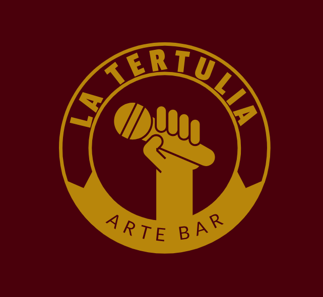
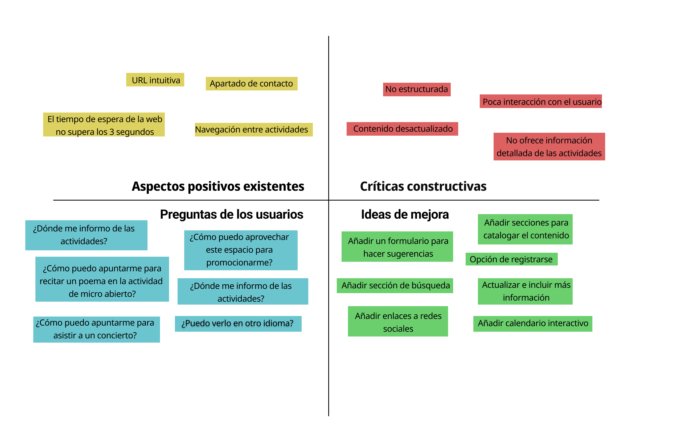
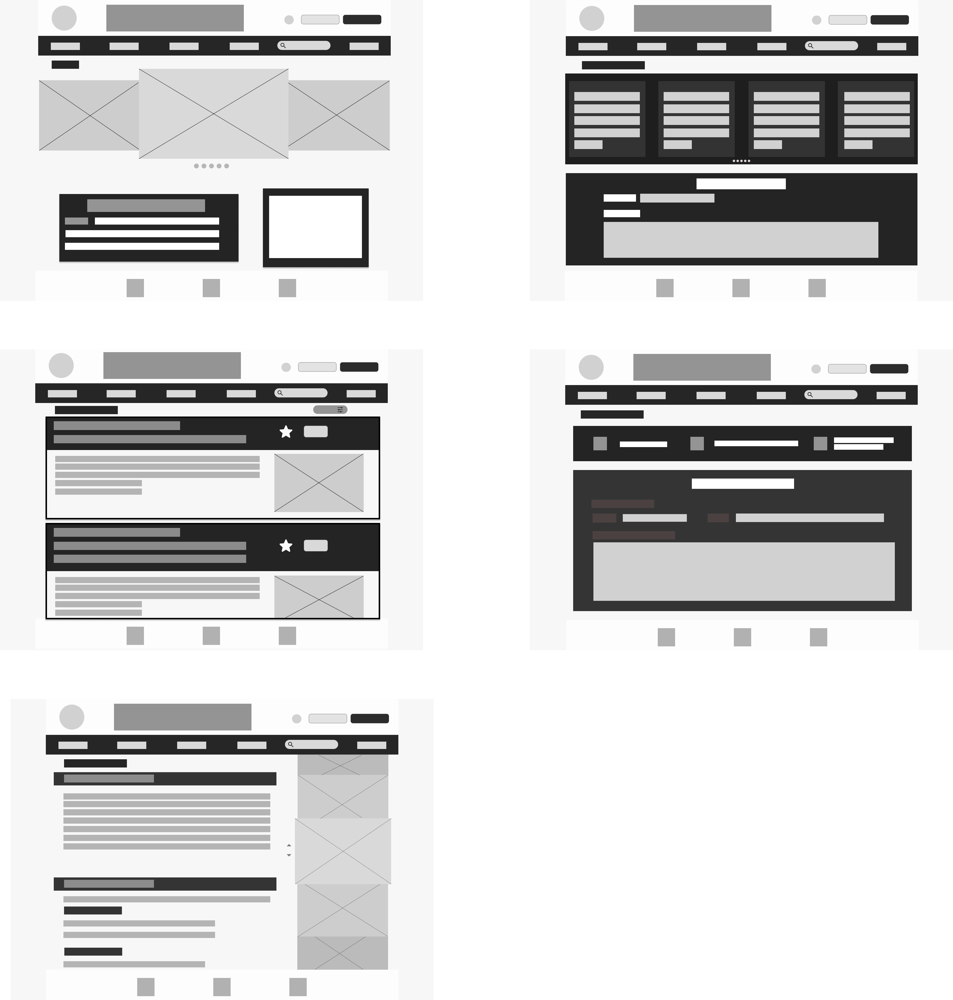
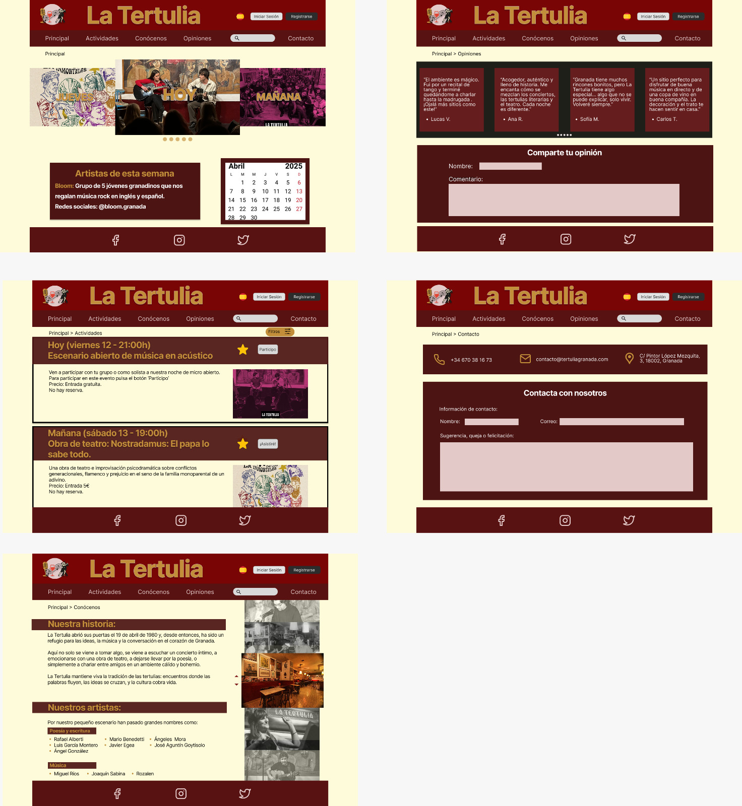

# DIU25
Prácticas Diseño Interfaces de Usuario (Tema: .... ) 

[Guiones de prácticas](GuionesPracticas/)

Grupo: DIU2.string  Curso: 2024/25 

Actualizado: 20/03/2025

Proyecto: 

La Tertulia

Descripción: 

>>> Describa la idea de su producto en la práctica 2

Nuestra propuesta consiste en el rediseño total de la página web. Para ello queremos hacer un diseño más atractivo y mejor estructurado, de forma que la información esté disponible a partir de un menú y sea más accesible para el usuario. 

Logotipo: 

>>> Si diseña un logotipo para su producto en la práctica 3 pongalo aqui, a un tamaño adecuado. Si diseña un slogan añadalo aquí

Miembros:
 * :bust_in_silhouette:  Sofía González Uceda    https://github.com/sofiiaglez11  :octocat:     
 * :bust_in_silhouette:  María Ramos Martínez    https://github.com/mariarmm :octocat:

----- 

>>> Este documento es el esqueleto del Case Study que explica el proceso de desarrollo de las 5 prácticas de DIU. Aparte de subir cada entrega a PRADO, se debe actualizar y dar formato de informe final a este documento online. Elimine este tipo de texto / comentarios desde la práctica 1 conforme proceda a cada paso

# Proceso de Diseño 

 

## Paso 1. UX User & Desk Research & Analisis 

### 1.a User Reseach Plan
 
-----

Nuestro análisis va a ser sobre La Tertulia, un bar que combina actividades socioculturales
con gastronomía, ofreciendo la oportunidad a cualquier persona interesada en participar en
recitales, charlas, conciertos, etc.  
Para recopilar información, indagaremos en sus redes sociales (Facebook e Instagram),
donde se publica la planificación semanal de las actividades. Además, tendremos en cuenta
nuestra experiencia y la de algunos conocidos que frecuentan el sitio. Preguntaremos
acerca de su visión general y cómo se informan acerca del local y sus actividades, además
de, en cada caso, preguntas específicas según el tipo de usuario (si realizan alguna
actividad, cuál, si se apuntan a ellas y con qué método…). También aprovecharemos para
preguntarles qué necesitarían en una página web para que su experiencia como usuarios
mejore. Otro aspecto que tendremos en cuenta serán las reseñas de los usuarios en
distintos sitios web.  
Aunque la manera que tiene La Tertulia de informar a los usuarios es mediante sus redes
sociales, también tiene una página web pero está desactualizada. Haremos un análisis de
esta, viendo qué ofrece y qué aspectos pueden mejorar.

### 1.b Competitive Analysis
 
-----
●​ Cata de vinos - La taberna de Kafka https://www.instagram.com/latabernadekafka/  
La taberna de Kafka se encuentra en el centro de Granada (Calle Huete, 2). Es una
taberna especializada en vino donde ofrecen tapas caseras y platos, con la
posibilidad de opciones vegetarianas, veganas y sin gluten. Está enfocada a su
variedad de vinos, organizando numerosas catas. Para acudir a ellas, al ofrecer un
número limitado de plazas, normalmente se requiere reserva, que se puede realizar
a través de las redes sociales del local (que son la fuente de información para los
usuarios) o a través de Whatsapp. 
Para cada cata se detallan los vinos que se ofrecerán, además de que suelen seguir
una temática o estar relacionadas con alguna festividad. El precio suele estar por
debajo de los 30€.  
La taberna de Kafka está más enfocada al vino, mientras que la tertulia ofrece
actividades más variadas. Claramente, cada uno está enfocado a un público distinto.  
Las páginas de ambos son similares, ya que en los dos casos los locales cuentan
con Facebook e Instagram. Sin embargo, en la Tertulia se publican fotos con la
planificación semanal de actividades, mientras que en la taberna se sube una foto y
en la descripción se detalla la actividad, las fechas disponibles, el precio y los
métodos de contacto para reservar. 
En las reseñas de la taberna, los clientes destacan la gran variedad de vinos, y el
ambiente acogedor del lugar.  

●​ Talleres de comida  
Granada Cooking Experience se encuentra en pleno centro de Granada (Calle de la
Monterería, 16). Es un local dirigido a todos los amantes de la gastronomía que se
quieran ver inmersos en la elaboración de los platos que van a degustar. Organizan
talleres de cocina de diferentes culturas, además de catas de vino. También ofrecen
la posibilidad de reservar un taller en específico para grupos de 6 personas.  
Para reservar alguno de sus talleres se debe hacer a través de su página web, pero
también tienen redes sociales como Instagram o Facebook. El precio de los talleres
es de 50€, esto incluye los ingredientes y los utensilios de cocina que se necesite,
un profesor que te guía en la elaboración y 3 bebidas.  
Comparando ambos locales, Granada Cooking Experience aporta una experiencia
más culinaria ya que el cliente participa en la elaboración de los platos; mientras que
en La Tertulia el cliente no tiene esa posibilidad. Sin embargo, consideramos que
son conceptos muy distintos, en Granada Cooking Experience el objetivo es la
cocina y la degustación; mientras que la finalidad de La Tertulia no es la comida, si
no disfrutar de los espectáculos que ofrecen, charlar con amigos y realizar otras
actividades como, por ejemplo, aprender tango.  
Un aspecto destacable de Granada Cooking Experience es la comodidad para
reservar los talleres a través de su página web. En La Tertulia, si quieres asistir
como público, en algunos casos no debes hacer reserva. Sin embargo, hay otras
actividades con aforo limitado para las que tienes que hacer tu reserva mediante un
correo. Además, si quieres participar en algún espectáculo debes avisar también por
correo con antelación.  
Los clientes del Granada Cooking Experience remarcan que es una experiencia
diferente en la que puedes conocer gente y aprender de cocina.  

● Justificación de la elegida 
Hemos elegido La Tertulia porque es un lugar que conocemos y nos gusta. Además,
estamos acostumbradas al Instagram del local ya que solemos asistir a espectáculos de
música en directo y para ello consultamos la planificación semanal. Por tanto, sabemos qué
información suele ser la más interesante y somos conscientes de los aspectos que se
podrían mejorar. 
Comparándolo con los demás competidores, nos parece que es la opción más atractiva
teniendo en cuenta nuestros gustos y aficiones. Además, estamos familiarizadas con el
lugar y tenemos una idea de las personas que lo frecuentan. Conocer esto nos ayudará a
intuir qué necesidades pueden tener otras personas respecto a la Tertulia.  
Además, comparando su página web con la de Granada Cooking, por ejemplo, nos damos
cuenta de la importancia que tiene que un local tenga una plataforma para el usuario fácil y
accesible. Como la página actual de La Tertulia está muy lejos de eso, queremos ver cómo
podría mejorarse.  

### 1.c Personas
 
-----

https://github.com/sofiiaglez11/DIU2-string/blob/master/P1/PERSONA_USER_JOURNEY_BIANCA.pdf  
Hemos diseñado el perfil de Bianca porque representa a una generación de personas
jóvenes que quieren reivindicarse con su arte. Además, su pasión por la poesía hace que
Bianca cubra también el papel de cliente que va a La Tertulia no solo a consumir, sino
también a participar activamente en las actividades que ofrecen. 
También describe a un perfil de cliente típico de La Tertulia: los turistas; los cuales llegan a
la ciudad y quieren visitar sitios que le permita adentrarse en la cultura de Granada.  

https://github.com/sofiiaglez11/DIU2-string/blob/master/P1/PERSONA_USER_JOURNEY_DANIEL.pdf  
Hemos elegido a Daniel como nuestro segundo perfil por su pasión por el deporte y su
necesidad de aprender disciplinas nuevas constantemente. Consideramos que puede ser
una persona interesada en ir a La Tertulia para asistir a las clases de tango. 
También creemos que es un perfil bueno para representar el contraste entre él y Bianca.
Daniel es una persona adulta con un puesto de trabajo estable que quiere asistir a La
Tertulia para disfrutar de su tiempo libre; mientras que Bianca es un perfil más juvenil que
está interesada en asistir a La Tertulia no solo para disfrutar, si no también para
promocionar su trabajo.

### 1.d User Journey Map
 
----
Bianca. 

[USER JOURNEY MAP BIANCA](P1/PERSONA_USER_JOURNEY_BIANCA.pdf)
https://github.com/sofiiaglez11/DIU2-string/blob/master/P1/PERSONA_USER_JOURNEY_BIANCA.pdf  
Hemos hecho el Journey Map de Bianca con la idea de representar una experiencia
satisfactoria de un cliente. Bianca es una persona que muestra interés en asistir a La
Tertulia a una actividad en concreto y, al final, a pesar de no encontrar información y
frustrarse en el proceso, termina yendo porque confía en el criterio del amigo se lo
recomendó.  

Daniel 
https://github.com/sofiiaglez11/DIU2-string/blob/master/P1/PERSONA_USER_JOURNEY_DANIEL.pdf  
Con el Journey Map de Daniel hemos querido ejemplificar el caso de una persona que, a
pesar de tener bastante interés por asistir a una de las actividades que ofrecen, decide no ir
por la escasa información que encuentra en las redes sociales y en la página web. Así
demostramos la importancia de, entre otras cosas, mantener una página web actualizada y
útil para evitar perder potenciales clientes por el mal funcionamiento de esta.  

### 1.e Usability Review
 
----

>>>  El objetivo es revisar la usabilidad del competidor seleccionado. Usamos un checklist de verificación. Tras usarlo, subelo a la carpeta P1/ Ofrece aquí un parrafo para:
>>> - Enlace al documento: https://github.com/sofiiaglez11/DIU2-string/blob/master/P1/Usability-review.pdf
>>> - URL y Valoración numérica obtenida: 
>>> - Comentario sobre la revisión:  (puntos fuertes y débiles detectados)

 

## Paso 2. UX Design  

### 2.a Reframing / IDEACION: Feedback Capture Grid / Empathy map 
 
----

>>> Comenta con un diagrama los aspectos más destacados a modo de conclusion de la práctica anterior. De qué carece la competencia?? Tu diagrama puede ser una figura subida a la carpeta P2/

 Interesante | Críticas     
| ------------- | -------
  Preguntas | Nuevas ideas

  

  
    
>>> Explica el Problema y plantea una hipótesis. Es decir, explica aquí qué 
>>> se plantea como "propuesta de valor" para un nuevo diseño de aplicación propio

### 2.b ScopeCanvas

----

>>> Propuesta de valor, pero ahora en vez de un texto es un ScopeCanvas que has subido a P2/ y enlazado desde aqui. Tambien vale una imagen miniatura del recurso.
>>> No olvides que tu propuesta ya tiene un nombre corto y puedes actualizar la cabecera de este archivo

### 2.b User Flow (task) analysis 
 
-----

>>> Definir "User Map" y "Task Flow" ... enlazar desde P2/ y describir brevemente
![Task Flow] (P2/P2-TaskFlow.png)

### 2.c IA: Sitemap + Labelling 
 
----

>>> Identificar términos para diálogo con usuario (evita el spanglish) y la arquitectura de la información. Es muy apropiado un diagrama tipo sitemap y una tabla que se ampliaría para llevar asociado la columna iconos (tanto para la web como para una app). 

Término | Significado     
| ------------- | -------
  Login  | acceder a plataforma

### 2.d Wireframes
 
-----

>>> Plantear el diseño del layout para Web/movil (organización y simulación). Describa la herramienta usada

 

## Paso 3. Mi UX-Case Study (diseño)

>>> Cualquier título puede ser adaptado. Recuerda borrar estos comentarios del template en tu documento

### 3.a Moodboard

-----

>>> Diseño visual con una guía de estilos visual (moodboard) 
>>> Incluir Logotipo. Todos los recursos estarán subidos a la carpeta P3/
>>> Explique aqui la/s herramienta/s utilizada/s y el por qué de la resolución empleada. Reflexione ¿Se puede usar esta imagen como cabecera de Instagram, por ejemplo, o se necesitan otras?

### 3.b Landing Page
 
----

>>> Plantear el Landing Page del producto. Aplica estilos definidos en el moodboard

### 3.c Guidelines
 
----

>>> Estudio de Guidelines y explicación de los Patrones IU a usar 
>>> Es decir, tras documentarse, muestre las deciones tomadas sobre Patrones IU a usar para la fase siguiente de prototipado.

### 3.d Mockup
 
----
>>> Consiste en tener un Layout en acción. Un Mockup es un prototipo HTML que permite simular tareas con estilo de IU seleccionado. Muy útil para compartir con stakeholders

Mockup: https://www.figma.com/proto/fWuTnBIUxemjLweb523xS5/Practica3?node-id=58432-2274&p=f&t=yIoXDyVhFkoT08bm-1&scaling=min-zoom&content-scaling=fixed&page-id=0%3A1

### 3.e ¿My UX-Case Study?
 
-----

>>> Publicar my Case Study en Github... Es el momento de dejar este documento para que sea evaluado y calificado como parte de la práctica
>>> Documente bien la cabecera y asegurese que ha resumido los pasos realizados para el diseño de su producto

 

## Paso 4. Pruebas de Evaluación 

### 4.a Reclutamiento de usuarios 

-----

>>> Breve descripción del caso asignado (llamado Caso-B) con enlace al repositorio Github
>>> Tabla y asignación de personas ficticias (o reales) a las pruebas. Exprese las ideas de posibles situaciones conflictivas de esa persona en las propuestas evaluadas. Mínimo 4 usuarios: asigne 2 al Caso A y 2 al caso B.

| Usuarios | Sexo/Edad     | Ocupación   |  Exp.TIC    | Personalidad | Plataforma | Caso
| ------------- | -------- | ----------- | ----------- | -----------  | ---------- | ----
| User1's name  | H / 18   | Estudiante  | Media       | Introvertido | Web.       | A 
| User2's name  | H / 18   | Estudiante  | Media       | Timido       | Web        | A 
| User3's name  | M / 35   | Abogado     | Baja        | Emocional    | móvil      | B 
| User4's name  | H / 18   | Estudiante  | Media       | Racional     | Web        | B 

### 4.b Diseño de las pruebas 
 
-----

>>> Planifique qué pruebas se van a desarrollar. ¿En qué consisten? ¿Se hará uso del checklist de la P1?

### 4.c Cuestionario SUS
 
----

>>> Como uno de los test para la prueba A/B testing, usaremos el **Cuestionario SUS** que permite valorar la satisfacción de cada usuario con el diseño utilizado (casos A o B). Para calcular la valoración numérica y la etiqueta linguistica resultante usamos la [hoja de cálculo](https://github.com/mgea/DIU19/blob/master/Cuestionario%20SUS%20DIU.xlsx). Previamente conozca en qué consiste la escala SUS y cómo se interpretan sus resultados
http://usabilitygeek.com/how-to-use-the-system-usability-scale-sus-to-evaluate-the-usability-of-your-website/)
Para más información, consultar aquí sobre la [metodología SUS](https://cui.unige.ch/isi/icle-wiki/_media/ipm:test-suschapt.pdf)
>>> Adjuntar en la carpeta P4/ el excel resultante y describa aquí la valoración personal de los resultados 

### 4.d A/B Testing
 
-----

>>> Los resultados de un A/B testing con 3 pruebas y 2 casos o alternativas daría como resultado una tabla de 3 filas y 2 columnas, además de un resultado agregado global. Especifique con claridad el resultado: qué caso es más usable, A o B?

### 4.e Aplicación del método Eye Tracking 

----

>>> Indica cómo se diseña el experimento y se reclutan los usuarios. Explica la herramienta / uso de gazerecorder.com u otra similar. Aplíquese únicamente al caso B.

  
>>> Cambiar esta img por una de vuestro experimento. El recurso deberá estar subido a la carpeta P4/  

>>> gazerecorder en versión de pruebas puede estar limitada a 3 usuarios para generar mapa de calor (crédito > 0 para que funcione) 

### 4.f Usability Report de B
 
-----

>>> Añadir report de usabilidad para práctica B (la de los compañeros) aportando resultados y valoración de cada debilidad de usabilidad. 
>>> Enlazar aqui con el archivo subido a P4/ que indica qué equipo evalua a qué otro equipo.

>>> Complementad el Case Study en su Paso 4 con una Valoración personal del equipo sobre esta tarea

 

## Paso 5. Exportación y Documentación 

### 5.a Exportación a HTML/React
 
----

>>> Breve descripción de esta tarea. Las evidencias de este paso quedan subidas a P5/

### 5.b Documentación con Storybook

----

>>> Breve descripción de esta tarea. Las evidencias de este paso quedan subidas a P5/

 

## Conclusiones finales & Valoración de las prácticas

>>> Opinión FINAL del proceso de desarrollo de diseño siguiendo metodología UX y valoración (positiva /negativa) de los resultados obtenidos. ¿Qué se puede mejorar? Recuerda que este tipo de texto se debe eliminar del template que se os proporciona 

